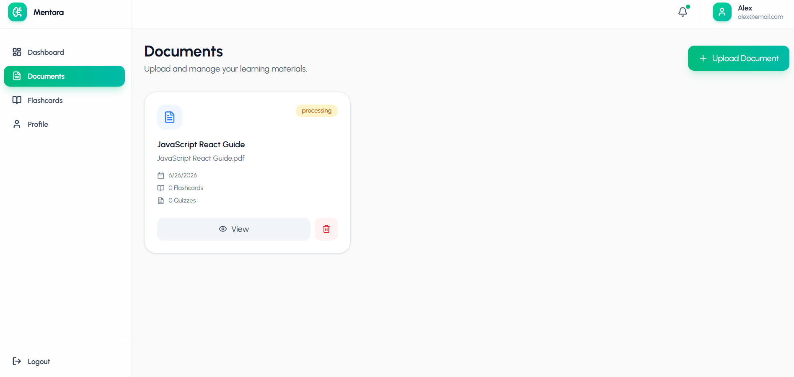
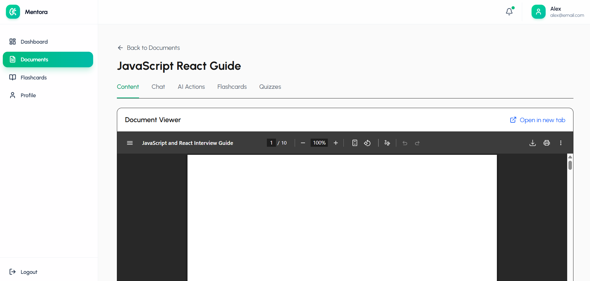
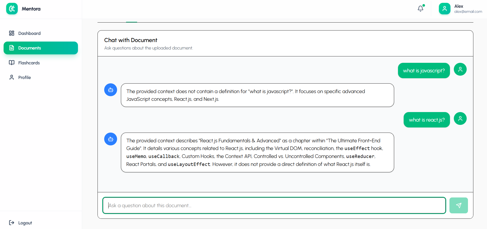
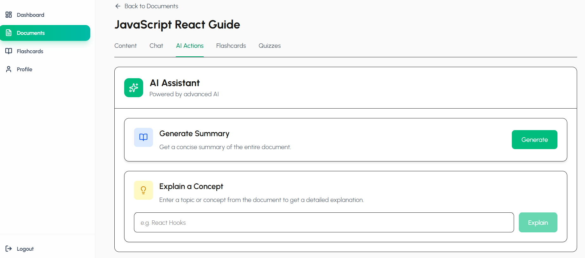
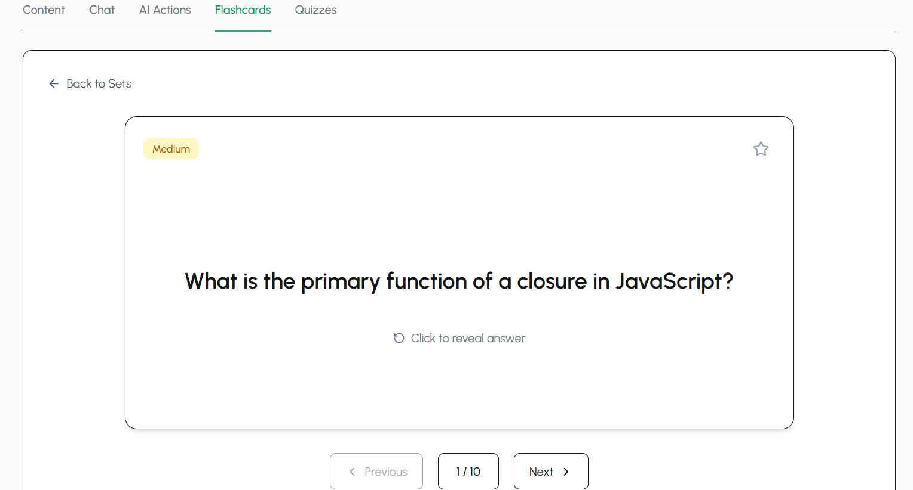
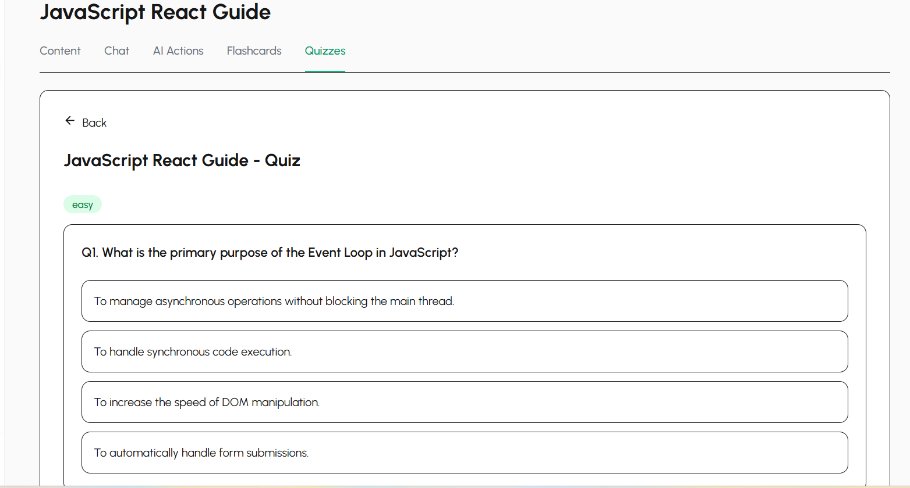
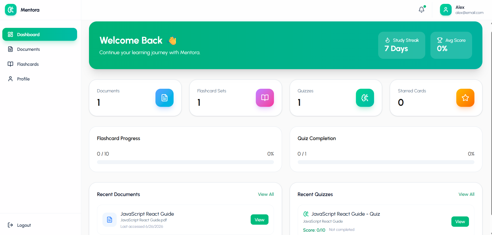

# 📚 Mentora – AI-Powered Learning Assistant

Mentora is a full-stack AI-powered study platform that transforms PDFs into interactive learning experiences. Upload your study materials and leverage AI to chat with documents, generate summaries, create flashcards, take quizzes, and track your learning progress—all from one modern web application.

---

## 🚀 Features

### 🔐 Authentication

* Secure user registration and login
* JWT-based authentication and authorization
* Protected routes and user-specific data


### 📄 Document Management

* Upload PDF documents
* Store and manage study materials
* Track uploaded file sizes
* Embedded PDF viewer for seamless reading




### 🤖 AI-Powered Learning

* **AI Chat:** Ask questions about your uploaded documents using Google Gemini
* **AI Document Summary:** Generate concise summaries of entire PDFs
* **AI Concept Explainer:** Get detailed explanations of selected topics from your documents




### 🧠 Smart Study Tools

* Automatically generate flashcards from document content
* Interactive flashcards with smooth flip animations
* Favorite important flashcards for quick revision



### 📝 AI Quiz Generator

* Generate custom multiple-choice quizzes
* Configure the number of quiz questions
* Instant evaluation with detailed explanations
* View quiz scores and performance analytics



### 📊 Progress Dashboard

* Track total uploaded documents
* Monitor generated flashcards
* View completed quizzes
* Recent activity feed for learning progress



### 🎨 Modern UI

* Responsive design for desktop, tablet, and mobile
* Clean and intuitive user interface
* Built with Tailwind CSS

---

## 🛠️ Tech Stack

### Frontend

* React.js
* Tailwind CSS
* React Router
* Axios

### Backend

* Node.js
* Express.js
* MongoDB
* Mongoose
* JWT Authentication

### AI Integration

* Google Gemini API

### File Handling

* PDF Parsing
* PDF Viewer
* File Uploads with Multer

---

## 📂 Project Structure

```text
Mentora/
├── client/          # React Frontend
├── server/          # Express Backend
├── uploads/         # Uploaded PDF Files
├── README.md
└── package.json
```

---

## ⚡ Installation

### 1. Clone the Repository

```bash
git clone https://github.com/yourusername/mentora.git
cd mentora
```

### 2. Install Dependencies

#### Backend

```bash
cd backend
npm install
```

#### Frontend

```bash
cd mentora-frontend
npm install
```

### 3. Configure Environment Variables

Create a `.env` file inside the **server** directory.

```env
PORT=5000
MONGO_URI=your_mongodb_connection_string
JWT_SECRET=your_jwt_secret
JWT_EXPIRE=7d
NODE_ENV=development
MAX_FILE_SIZE=10485760
GEMINI_API_KEY=your_google_gemini_api_key
```

### 4. Start the Application

#### Backend

```bash
cd server
npm run dev
```

#### Frontend

```bash
cd client
npm run dev
```

---

## 📸 Key Functionalities

* ✅ JWT Authentication
* ✅ PDF Upload & Management
* ✅ Embedded PDF Viewer
* ✅ AI Chat with Documents
* ✅ AI Document Summarization
* ✅ AI Concept Explainer
* ✅ Auto-Generated Flashcards
* ✅ Flashcard Favorites
* ✅ AI Quiz Generator
* ✅ Quiz Analytics
* ✅ Progress Dashboard
* ✅ Responsive User Interface

---

## 🎯 Future Enhancements

* OCR support for scanned PDFs
* Dark mode
* AI-generated study notes
* Spaced repetition for flashcards
* Voice-based document interaction
* Collaborative study groups
* Export flashcards and quizzes
* Document search across multiple PDFs

---

## 🤝 Contributing

Contributions are welcome!

1. Fork the repository
2. Create a feature branch

```bash
git checkout -b feature/your-feature
```

3. Commit your changes

```bash
git commit -m "Add your feature"
```

4. Push to your branch

```bash
git push origin feature/your-feature
```

5. Open a Pull Request

---

## 📄 License

This project is licensed under the MIT License.

---

## 👨‍💻 Author

**Mohd Yawar**

If you found this project helpful, consider giving it a ⭐ on GitHub!
